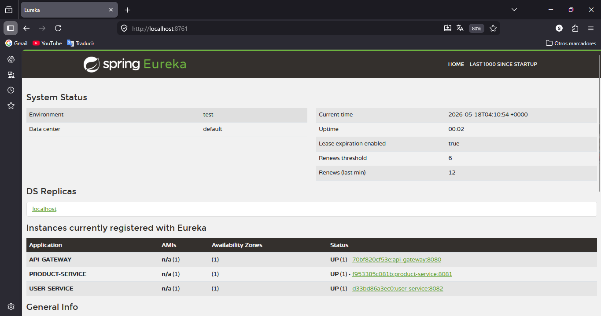
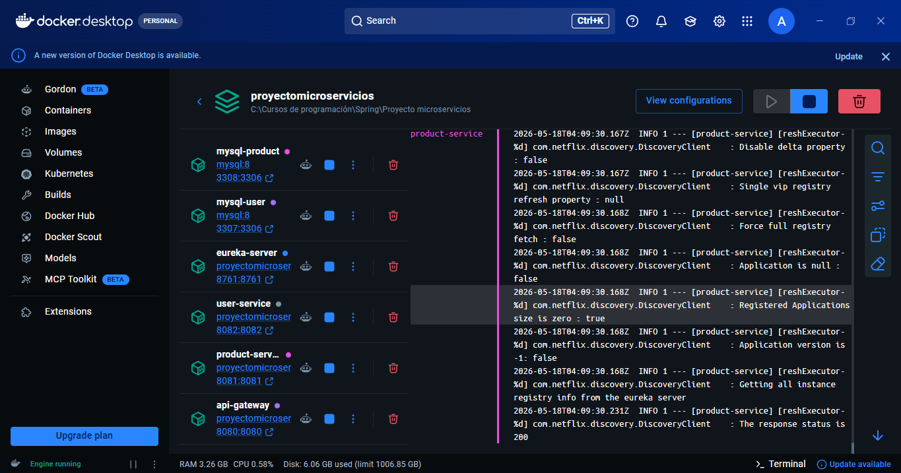

# Proyecto de Microservicios con Springboot y Docker

<p>Este proyecto implementa una arquitectura de microservicios utilizando Springboot. Incluye descubrimiento de microservicios, gateway de entrada, comunicación entre servicios y contenedor completa con docker.</p>
<p>El sistema está compuesto por varios microservicios independientes que se comunican entre sí y se registran dinámincamente en un servidor de descubrimiento.</p>

# Arquitectura
<p>El sistema esta compuesto por los siguientes servicios:</p>
<li>Eureka Server -> Registro y descubrimiento de servicios</li>
<li>API Gateway: Punto de entrada para todas las peticiones</li>
<li>Product Service: Gestión de productos</li>
<li>User Service: Gestión de usuarios y consumo de Prodcut Service</li>
<li>MySQL: Base de datos</li>

# Flujo del sistema
Cliente -> API Gateway -> Eureka -> Microservicios -> MySQL

# Tecnologías utilizadas
<li>Java 21</li>
<li>Spring boot</li>
<li>Spring Cloud (Eureka, Gateway, OpenFeing)</li>
<li>Maven</li>
<li>MySQL</li>
<li>Docker y Docker Compose</li>

# Caracteristicas principales
<li>Arquitectura de mciroservicios</li>
<li>Registro y descubrimiento de servicios</li>
<li>Comunicación entre microservicios con OpenFeing</li>
<li>Manejo de Errores y fallback</li>
<li>Conterización completa con Docker</li>

# Como ejecutar el proyecto 
1. Clonar el repositorio
[Git clone] (https://github.com/AlejandroSC-dev/Proyecto-microservicios.git)

2. Construir los proyectos:
En cada microservicio ejecutar:
```bash
mvnw clean package -DskipTest
```

3. Levantar los contenedores
```bash
docker-compose up --build
```
4. Acceder a los servicios

<li>Eureka Server:</li>
http://localhost:8761

<li>Api Gateway</li>
http://localhost:8080

# Endpoints 

## Obtener productos
GET/products

## Obtener usuarios
GET/users

## Comunicación entre microservicios
GET/user/product{id}

# Docker
<p>El proyecto utiliza Docker Compose para levantar todos los servicios cpn un solo comando.</p>
<p>Cada microservicio está contenido en su propio contenedor, incluyendo la base de datos</p>

# Vista previa





## Este proyecto desarrollado como práctica de arquitectura de microservicio.
## Este proyecto es de uso educativo
